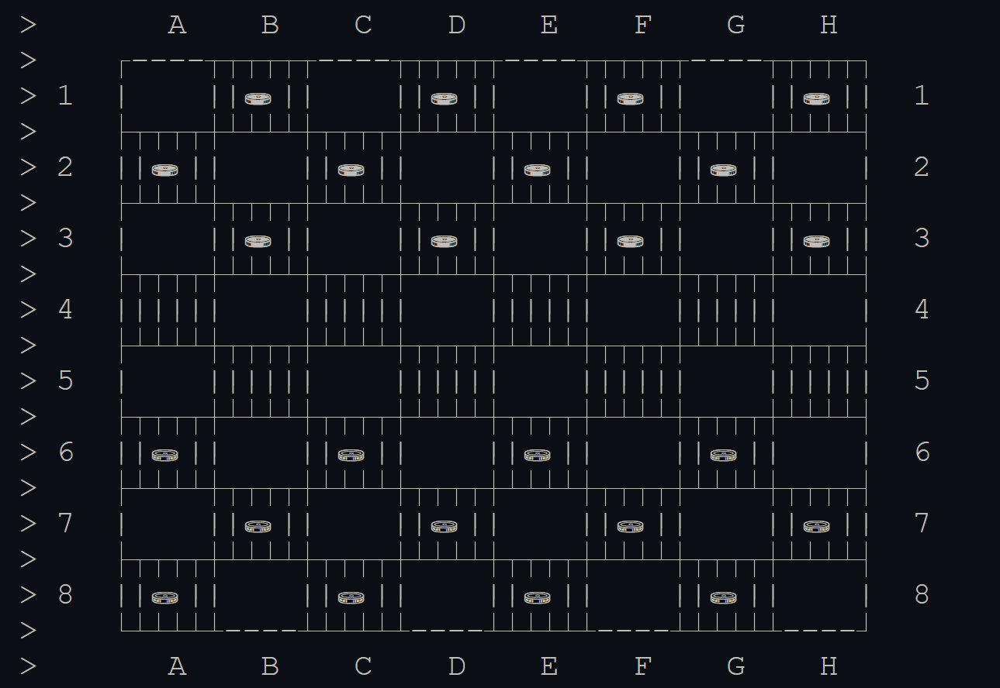
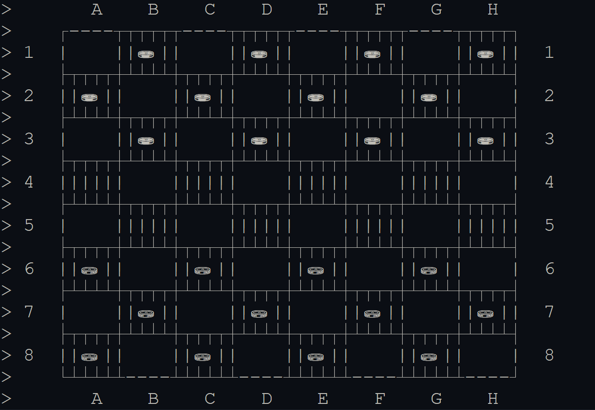
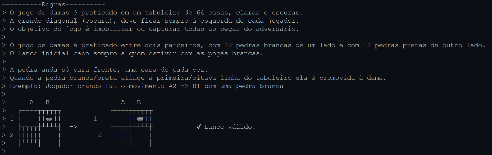

# Damas em py

Damas em python para dois jogadores no terminal
- [Damas em py](#damas-em-py)
- [Como Jogar](#como-jogar)
- [Updates](#updates)
  - [1.1.0 - Tabuleiro Update](#110---tabuleiro-update)
    - [Novo Tabuleiro](#novo-tabuleiro)
    - [Novas Regras](#novas-regras)
  - [1.0.0 - Lançamento Damas](#100---lançamento-damas)
- [Futuro (Fora de Ordem)](#futuro-fora-de-ordem)

# Como Jogar

- Instale as últimas versões do Python e do Visual Studio Code na sua máquina
- Abra main.py e rode o programa

# Updates

## 1.1.0 - Tabuleiro Update

- Imagens do tabuleiro inseridas nas Regras
- Pequenas mudanças na estrutura dos arquivos e no código
- Novo Tabuleiro implementado 

### Novo Tabuleiro

### Novas Regras

## 1.0.0 - Lançamento Damas

- Damas completamente jogáveis para dois jogadores
- Menu para consulta de regras antes do jogo
- Nomes customizados para cada jogador

# Futuro (Fora de Ordem)

- [ ] Análise para possível refatoração e restruturação
- [X] Inserção de imagens como _visual aids_ na seção de regras
- [ ] Implementação de regras de empate no código, assim como dar a opção do jogador desistir ou pedir um empate
- [ ] Tratamento de input, para evitar a interrupçãodo jogo abruptamente, causando sua perda consequentemente.
- [X] Esturação final do readme do repositório, com imagens, histórico de updates etc.
